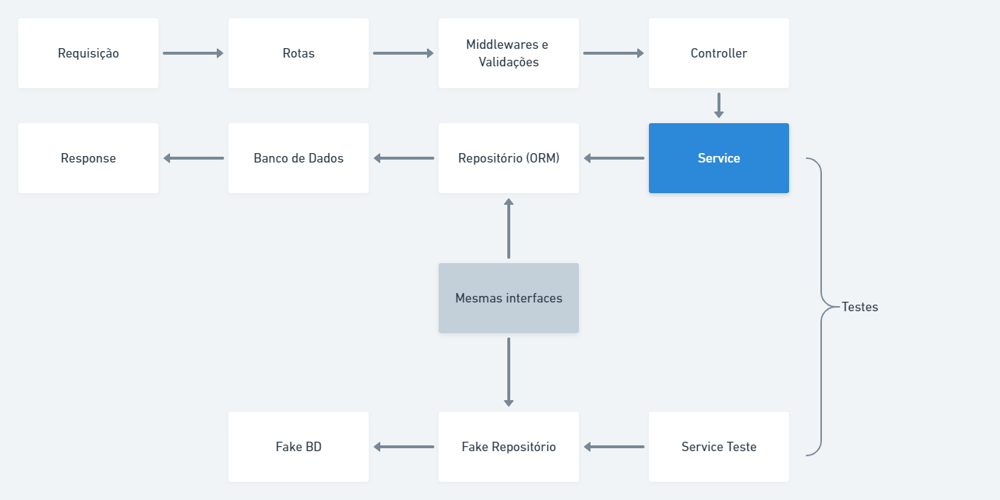

# Template Api
## Ferramentas
* Express
* MariaDB
* Typescript
* TypeORM
* Teste unitários com JEST

# Introdução
Esse repositório tem o objetivo de auxiliar no ponto de partida da criação de uma API Node. A API foi desenvolvida visando boas práticas mas melhorias são sempre bem-vindas, caso achar que algo possa ser feito melhor, abra uma PR que irei avaliar.

# Estrutura da API
A API segue a lógica da imagem abaixo:


Todo o código da API se encontra na pasta `./src`:
## @types
Tipagens adicionais, como por exemplo, foi incluído um objeto user com a propriedade id no objeto de request do express para ser utilizado no middleware de autenticação;
## config
Arquivos auxiliares de configuração como configuração de base de dados, token JWT, e etc.
## modules
Os módulos da API, como ponto de partida foi criado o módulo de usuários que possui a estrutura necessária para a criação de outros módulos que a API venha a suportar. A escolha por criar um módulo de usuários é que esse é o módulo mais comum a ser criado e normalmente o primeiro.

### Entities
São as entidades, ou seja, são as classes que definem como os dados serão trabalhados dentro do módulo e como as tabelas do banco de dados serão criadas.
### Routes
Contém as rotas pertinentes ao módulo, nesse módulo foram criadas as rotas de usuários e de autenticação.

### Controllers
São as classes chamadas pelas rotas. Como boa prática um Controller deve possuir no máximo 5 métodos:
* store: Criação de entidades
* update: Atualização de entidades
* destroy: Deleção de entidades
* show: Pesquisar uma entidade singular
* index: Pesquisar mais de uma entidade

**Cada um desses métodos deve utilizar como parâmetros `request`, `response` e retornar uma `Promise<response>`**

Dentro dos controllers não ocorrem validações, apenas o recebimento de dados do request, instanciação e execução dos `Services` e retorno do `response`.

### Services
São as classes principais da API, são neles que as regras de negócio da API são validadas. Um `Service` deve possuir apenas um método público chamado `execute`, ou seja, um `Service` só pode possuir uma responsabilidade, de executar o serviço pelo qual foi criado.

O construtor de um `Service` deve receber as dependências que serão utilizadas dentro dele como por exemplo os repositórios de entidades que irá utilizar para realizar o seu serviço, além de provedores de outros serviços específicos como um provedor de hashs para criptografia de senhas, etc.

As dependências de um `Service` são injetadas no mesmo utilizando a lib `tsyringe` fazendo com que fique muito simples mudar a dependência que ele utiliza e realizar testes unitários.

É importante que a interface de dados que o método `execute` receber seja o mesmo tipo que será passado para o repositório principal desse `Service`, exemplo: No `CreateUserService`, foi utilizada a interface `ICreateUserDTO` como tipagem dos dados do método `execute` e essa é a mesma interface do método `save` do `UserRepositories`.


* **Rotas:** As requisições dos clientes são recebidas aqui, todas as rotas da aplicação são importadas no arquivo `./src/shared/routes/index.ts`

### Testes
Dentro da pasta services de cada módulo há uma pasta contendo os arquivos de teste. Cada Service possui um arquivo de teste respectivo, sugiro sempre que for criar um novo service, iniciar criando-o e criar o teste respectivo antes de criar o Controller, rotas e etc. Seguindo os conceitos de TDD.

Para rodar todos os testes basta rodar o comando `yarn test`. Será gerado um arquivo `html` com o relatório dos testes dentro de `./coverage/lcov-report/index.html`.

### Repositories
São abstrações do banco de dados, nessa API foi utilizado o typeORM para criar essas abstrações, mas pode ser feito com outro ORM tranquilamente.

Além do repositório do banco de dados, também são criados repositórios idênticos chamados de fakes. Esses fakeRepositories são utilizados como mock nos testes unitários dos `Services` e **devem** implementar as mesmas interfaces que o repositório do BD implementa. Essas interfaces estão localizadas dentro de `./src/modules/**/repositories/dto/I<entity>Repositoriy`

## shared
Contém arquivos que são compartilhados entre módulos

### container
Aqui é onde as dependências que serão injetadas nos `Services` estão sendo definidas, note que nem todas as dependências estão nesse arquivo, pois algumas estão registradas na pasta providers e apenas é importado o arquivo index.ts de providers, dessa forma fica mais organizado.

O arquivo `index.ts` da pasta container deve ser importado no topo do arquivo `server.ts` que é o arquivo rodado inicialmente ao subir o server.

### errors
Arquivos contendo as `Exceptions`, note que não há um try-catch nos `controllers`, portanto, os `throws` que são feitos dentro dos `Services` são pegos pelo `middleware` de erros localizado dentro dessa pasta e importado dentro de `server.ts`.

Dentro dessa pasta também está um `ENUM` de códigos HTTP que pode ser útil.

Sempre que criar uma nova `Exception` que receber um `statusCode`, tipar esse code com o type `HTTPStatusType` exportado dentro do arquivo `HTTPStatusEnum.ts`, vide exemplo das outras `Exceptions`.

### providers
São implementações de dependências externas, essas implementações devem respeitar uma interface definida dentro da pasta do provider, essa interface deve ser implementada também no provider Fake para que seja possível utilizá-lo nos testes unitários e manter os testes sem dependências externas.

### typeorm/migrations
Local onde os arquivos de migrations são armazenados, comandos úteis:
* Criar nova migration: `yarn typeorm migration:create -n <nomeDaMigration>`
* Rodar as migrations pendentes: `yarn typeorm migration:run`
* Reverter a última migration: `yarn typeorm migration:revert`

### utils
Algumas funções úteis para serem utilizadas, num primeiro momento criei apenas funções para utilizar nos testes unitários, foram usados tipos genéricos, portanto, não importa a entidade que o repositório possua, essa funções irão funcionar, mas qualquer bug me avise :D

## Instruções para rodar

### Crie um repositório a partir desse template
Após criar o repositório rode `yarn` para instalar todas as dependências.
**É necessário ter o node instalado, tenha a última versão LTS**
### Criando BD no Docker


```bash
# Criação do conteiner
docker run --name mariadb -e MYSQL_ROOT_PASSWORD=<root-pass> -p 1430:3306 --restart always -d mariadb
# A tag "--restart always" reinicia o container automaticamente caso ele cair.

# Acessar o conteiner
docker exec -it mariadb /bin/bash

# Atualizar os pacotes
apt-get update

# Instalar o sudo
apt-get install sudo

# Acessar o banco com o usuário root
sudo mysql -u root -p

# Criar o banco de dados
CREATE DATABASE <database>;

# Criar o usuário que será utilizado pela aplicação (nunca utilizar o usuário root)
CREATE USER <user>@localhost IDENTIFIED BY '<senha>';

# Aplicando as permissões para o usuário criado no branco de dados
GRANT ALL PRIVILEGES ON <database>.* TO <user>@localhost IDENTIFIED BY '<senha>';
FLUSH PRIVILEGES;


Para iniciar o container: docker run mariadb
```

Após criar a base de dados e iniciá-la, crie o arquivo `.env` a partir do arquivo `.env.example` e preencha os dados referente ao banco de dados. Exemplo:
```
# Banco de dados
TYPEORM_CONNECTION=mariadb
TYPEORM_HOST=localhost
TYPEORM_PORT=1234
TYPEORM_USERNAME=root
TYPEORM_PASSWORD=root
TYPEORM_DATABASE=my_db
TYPEORM_ENTITIES=./src/modules/**/entities/typeorm/*.ts
TYPEORM_MIGRATIONS=./src/shared/typeorm/migrations/*.ts
TYPEORM_MIGRATIONS_DIR=./src/shared/typeorm/migrations/

# TypeORM
TYPEORM_ENTITIES=./src/modules/**/entities/typeorm/*.ts
TYPEORM_MIGRATIONS=./src/shared/typeorm/migrations/*.ts
TYPEORM_MIGRATIONS_DIR=./src/shared/typeorm/migrations/

# Porta da API
PORT=3333

# Ambiente
NODE_ENV=dev

# Segredo JWT
SEGREDO=segredo

```

### Rode a API
Agora que o BD está criado e as dependências instaladas, rode `yarn dev:server` para rodar a API, o console irá mostrar essa mensagem:

```
✅ - back-end rodando! na porta 3333
✅ - Conectado ao DB
```
